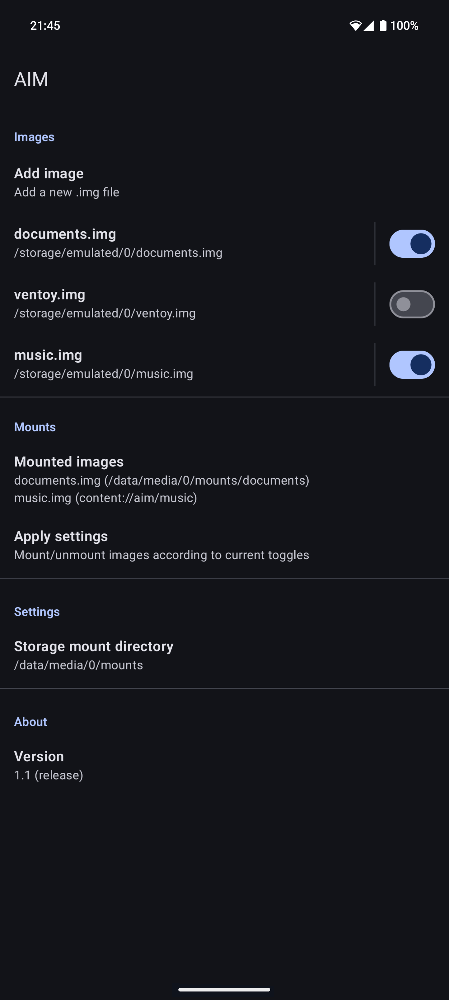

<!-- sorry -->

# AIM

 
 

AIM is an Android app for mounting `.img` files on your phone. Supports `ext4`, `exfat` and `fat32` filesystems.

It is installed as a normal app and root access is required.

## Features

* Supports Android 12+
* Supports mounting multiple images at once
  - Including mixing and matching different filesystems
* Formatting (`exFAT`, `ext4`)
* Multi partition support
* Mounting on internal storage and in documents provider

Meant to be the phone equivalent of [MSD](https://github.com/chenxiaolong/MSD)

## Limitations

* Must have root access and busybox installed
* Sparse (dynamic) images are not supported
* Only local files are supported
  - Must be on internal storage or sd card.
* Device must have filesystem support (most devices do)
  - Run `cat /proc/filesystems` in a rooted shell to check if they exist.
* Only tested on AOSP based ROMs

> [!CAUTION]
> This application runs as root and processes arbitrary user input to shell commands. This introduces security risks and while protective measures have been implemented to mitigate potential issues, no guarantees can be made. Use at your own risk.

## Usage

1. Download latest version from the [releases page](https://codeberg.org/dryerlint/AIM/releases).

2. Grant root permissions

3. Add one or more images and set mount options

4. Apply the settings

5. That's it!

AIM does not need to run in the background. Once configured, the mounted images remain available until they're explicitly disabled or the device is rebooted.

> [!IMPORTANT]
> Before uninstalling the app, check and unmount all images to prevent unexpected issues or data loss

## Permissions

AIM does not use any permissions except that of running commands as root. Which is dangerous and can introduce security holes that I am not aware of. I have tried my best at preventing such cases and parse carefully but cannot guarantee it is 100% foolproof.

## Other info

ISO file stypes are supported, but the filesystem `ISO9660` is hardly supported on modern kernels, and only will succeed if the ISO is formatted as any of the supported filesystems. The app will however, attempt to mount and will fail if your device does not support it.

## License

AIM is licensed under GPLv3. Please see [`LICENSE`](./LICENSE) for the full license text.
